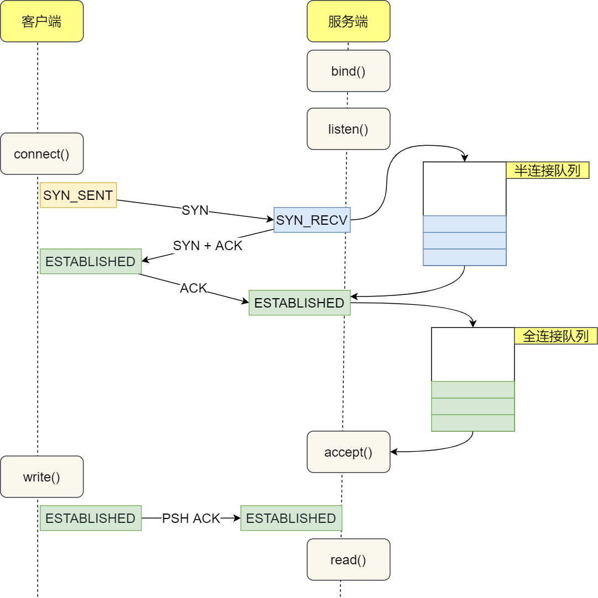

# TCP常考问题汇总

### TCP连接为什么要进行三次握手？
TCP连接建立时需要在双方都维护一个序列号(ISN)并通知对方；基于这个序列号，接收消息的一方才可以知道目前收到的消息是否重复、连续；这是TCP能保证可靠连接的基础。
而TCP是一个双工的协议，为了保证双方都可以可靠通信，必须经过三次握手，让双方都初始化一个ISN并告知另一方。
两次握手是不够的，四次握手则没有必要。

```
Client  Server
    ->SYN
    <-ACK/SYN
    ->ACK
```

### 在TCP中什么是半连接队列？
Linux内核针对TCP协议会维护两个队列分别是 syn队列 和 accept队列。
内核收到 syn 请求的时候就会将连接放入 syn队列 也就是半连接队列；当收到第三次握手的ACK时候，则会将连接从半连接队列中移除，放入 accept队列 等待系统调用 accept 将连接取出，并进行后续 read 等操作。


### 什么是TCP粘包现象？
TCP是基于字节流的传输层协议；应用层的消息可能会被拆分重组成一个数据段发给目标主机。
比如Nagle算法就是这样一种拆分重组从而减少数据包数量进而提高TCP传输效率的算法；它就会导致粘包现象的出现。应用层一次传输的数据若不多；则会暂存于系统缓冲区，等待下次请求的数据来临；如果两次的数据之和超过MSS的大小，则会将数据拆成MSS+剩余大小，分两次进行发送。则应用层分离的两个消息被放入了同一个segment；即粘包现象。
解决方案就是定义清楚消息的边界；通常可以采用确定长度或增加终结符两种方案进行解决。

### TCP协议中的滑动窗口是指什么？
滑动窗口也被称为通告窗口是接收方发送给发送方用于限制传输速率的手段。发送方可以最多发送滑动窗口大小的未确认分组信息；超过则需要等待接收方的回复。

### TCP是如何做拥塞控制的？
拥塞控制主要手段是引入拥塞窗口。当发送方发现网络出现拥塞时，TCP会通过控制拥塞窗口大小降低传输的最大分组数量，使得网络拥塞得以缓解。
具体包括四个拥塞控制方法：慢启动、拥塞避免、快重传、快恢复四种。
